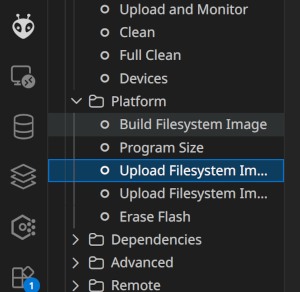
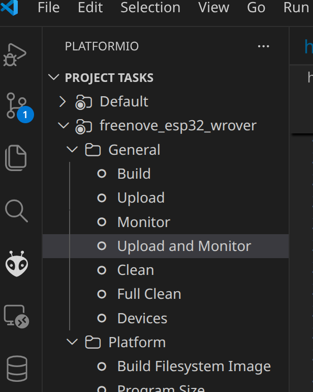

# 🚀 (Prototype) ESP32 Mini WebServer Framework

<div align="center">


### ⚠️ This is still a Prototype for my Personal Projects

### 🤓 So Please be nice with your Feedback

</div>

## 🎯 Overview

A lightweight **Mini WebServer Framework** for ESP32 microcontrollers! 🎉 

This framework is a personal Project providing a MiniWebserver with dynamically managable Endpoints and easier request and response handling! 📊✨

## 📁 Project Structure

- Just include the folder **lib/server/** and include to your main.cpp and routes.<name>.h as described.
- Or use the compact folder **lib/compact**  and include to your main.cpp and routes.<name>.h as described.

```
📦 ESP32 Mini WebServer Framework
├── 📁 src/
│   ├── 🎯 main.cpp                 # Main application entry
│   └── 📁 routes/
│       └── 🛤️ routes.test.h        # API route definitions
│       └── 🛤️ routes.test.cpp      # API route Implementations
├── 📁 lib/
│   └── 📁 server/
│       ├── 🌐 server.h/.cpp        # Core web server
│       ├── 🛤️ router.h             # Routing engine
│       ├── 📥 request.h            # HTTP request handling
│       ├── 📤 response.h           # HTTP response handling
│       ├── 🔐 utility.admin.h           # Admin Dashboard
│       ├── 🛜 utility.wifi.h           # WiFi utility
│       └── 📋 ArduinoJson-v7.4.3.h # JSON library
├── 📁 data/
│   └── 📁 web/
│       └── 🎨 index.html           # Web interface
├── ⚙️ platformio.ini               # Build configuration
└── 📖 README.md                    # This file
```

## 🚀 Quick Start

### Prerequisites

- ✅ [PlatformIO IDE](https://platformio.org/platformio-ide) 
- ✅ ESP32 development board
- ✅ USB cable for programming 🔌
- ✅ WiFi network 📶

### Installation

1. **Connect your ESP32 via USB Cable** 🔌

2. **Install Plattfrom.IO Extension** 💾

3. **Update WiFi credentials** 🔐
   Edit `src/main.cpp` and update your WiFi settings:
   ```cpp
   custom_utils::connectWiFi("YOUR_WIFI_NAME", "YOUR_PASSWORD");
   ```
   
4. **Build and Upload FileSystem (to push /data contents to ESP32)** 🔨



5. **Use Plattform.IO to Upload and Monitor code from main.cpp** 🔨



## 🎮 Usage

### **Accessing the Web Interface**

1. Connect your ESP32 to power
2. Wait for WiFi connection
3. Find the ESP32's IP address in serial monitor
4. Open your browser and navigate to `http://ESP32_IP_ADDRESS`

### **Example API Endpoints**

| Method | Endpoint | Description | Response |
|--------|----------|-------------|----------|
| 🟢 GET | `/hello` | Simple hello world | Text response 📝 |
| 🟢 GET | `/status` | Device status | JSON with device info 📊 |
| 🟢 GET | `/example` | Example Get | Text response 📝 |
| 🟡 POST | `/data` | Simple POST | JSON data response 📊 |

## 🛤️ Router System & Route Management

### 📁 **Router File Structure**

Routes are organized in separate header files within the `src/routes/` directory, each following a clean, consistent pattern:
These Router Constructor can be registered on the server.

```cpp
#include <../lib/server/server.h>

// Include the Router File
#include <routes/routes.example.h>

// Register Routes from the seperate Files
Server.registerRouter(routes_example::Router());
```

The included ```<routes/routes.example.h>``` header files defines all methods and the Router

```cpp

#include <Arduino.h>
#include <WiFi.h>

#include <../lib/server/router.h>

namespace routes_example
{
    /**
     ***********************************************
     ************************************************
     * Defining routes for overview and testing
     *
     *
     **/

    void get_hello(const ESP32WebServer::Request &req, ESP32WebServer::Response &res);
    void get_status(const ESP32WebServer::Request &req, ESP32WebServer::Response &res);
    void get_example(const ESP32WebServer::Request &req, ESP32WebServer::Response &res);
    void post_data(const ESP32WebServer::Request &req, ESP32WebServer::Response &res);

    class Router : public ESP32WebServer::Router
    {
    public:
        Router()
        {
            add("GET", "/hello", get_hello);
            add("GET", "/status", get_status);
            add("GET", "/example", get_example);
            add("POST", "/data", post_data);
        }
    };

}
```

The Code ist implemented in the CPP-File including its Header-File

```cpp

#include <routes/routes.example.h>

namespace routes_example
{
    /**
     ***********************************************
     ************************************************
     * Implementing actual routes
     *
     *
     **/
    void get_hello(const ESP32WebServer::Request &req, ESP32WebServer::Response &res)
    {
        res.text("Hello, World! This is a simple response from the ESP32.").status(200);
    }

    void get_status(const ESP32WebServer::Request &req, ESP32WebServer::Response &res)
    {
        JsonDocument status;

        status["device"] = "ESP32";
        status["firmware"] = "1.0.0";
        status["uptime"] = static_cast<double>(millis());
        status["free_heap"] = static_cast<double>(ESP.getFreeHeap());
        status["wifi_rssi"] = static_cast<double>(WiFi.RSSI());

        res.json(status).status(200);
    }

    void get_example(const ESP32WebServer::Request &req, ESP32WebServer::Response &res)
    {
        res.text("This is an example route!").status(200);
    }

    void post_data(const ESP32WebServer::Request &req, ESP32WebServer::Response &res)
    {
        JsonDocument response;
        response["message"] = "Data received successfully";
        response["timestamp"] = millis();
        res.json(response).status(201);
    }

}
```

#### ⚡ **Configure Routes on the Server**
```cpp
#include <Arduino.h>

#include <../lib/server/server.h>

// Include the Router File
#include <routes/routes.example.h>

ESP32WebServer::MiniServer Server = ESP32WebServer::MiniServer("0.0.0.0", 80);

void setup()
{
  Serial.begin(115200);

  // Connect to your HOME WiFi Network
  // This makes it directly reachable for any device in that network
  Server.connectWiFi("FRITZ!Box 6591 TPLink 2,4_EXT2", "**secret-pwd**");

  // Set a path as index (Needs LittleFS as FileSystem)
  Server.index("/web/index.html");

  // Register Routes from the seperate Files
  Server.registerRouter(routes_example::Router());

  // Directly Configure Routes
  // 🟢 GET routes
  // Server.add("GET", "/sensors", get_sensor_data);
  // Server.add("GET", "/system/info", get_system_info);
    
  // 🟡 POST routes
  // Server.add("POST", "/led", post_led_control);
  // Server.add("POST", "/config", post_configuration);
    
  // 🔵 PUT routes
  // Server.add("PUT", "/settings", put_update_settings);
}
```

### 🎨 **Route Organization Best Practices**

#### **📂 Organize by Functionality**
```
src/routes/
├── 🌡️ routes.sensors.h      # Temperature, humidity, pressure sensors
├── 💡 routes.control.h      # LED, relay, motor control
├── ⚙️ routes.system.h       # System info, diagnostics, configuration
├── 🔐 routes.auth.h         # Authentication & user management
├── 📊 routes.api.h          # General API endpoints
└── 🧪 routes.test.h         # Testing & development routes
```

#### **🏷️ Consistent Naming Convention**
```cpp
// Namespace naming: routes_{functionality}
namespace routes_sensors { ... }
namespace routes_control { ... }
namespace routes_system { ... }

// Function naming: {method}_{endpoint_name}
void get_temperature() { ... }
void post_led_control() { ... }
void put_system_config() { ... }
```

#### **📤 Sending Responses**

Sending Response is simplified with lots of helper methods and automatic building of the response under the hood.

```cpp
void get_example(const ESP32WebServer::Request &req, ESP32WebServer::Response &res) {
    // 📝 Text response
    res.text("Simple text response").status(200);
    
    // 📋 JSON response
    JsonDocument jsonData;
    jsonData["message"] = "Success";
    jsonData["timestamp"] = millis();
    res.json(jsonData).status(200);

    // Or
    res.json(jsonData).Ok();
    
    // 📁 File response
    res.file("/web/data.json").status(200);
    
    // ❌ Error responses
    res.text("Not found").status(404);
    res.text("Internal error").status(500);

    // Automatic 200 with some text
    res.Ok()
    // Automatic 404 with some text
    res.NotFound()
    // Automatic 500 Internal Server error
    res.InternalServerError()
}
```

## 📄 License

This project is licensed under the **MIT License** 📜 - see the LICENSE file for details.

## 🙏 Acknowledgments

- 🎉 **Arduino Community** for the amazing ecosystem
- 🔧 **PlatformIO** for the excellent development platform
- 🌐 **ESP32** community for inspiration and support
- 💖 **Open Source** contributors worldwide
